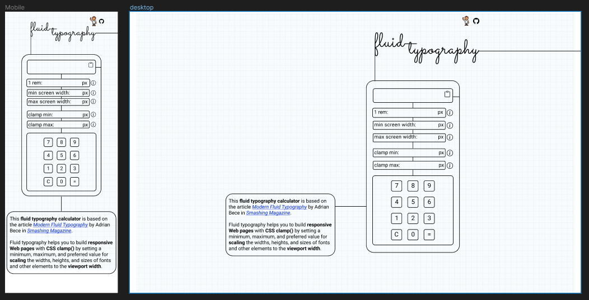

# Fluid Typography Calculator

## Figma Design Screenshot

## Post Mortem

The design was relatively simple and was fairly straightforward to implement. The biggest "issue" I had was with the `background-image`. I wanted to set the opacity to 50%, and initially tried to do so by setting it as the `background-image` with `:after` on the `body` element. However, it wouldn't cover the whole screen at extremely small widths. I noticed in the dev tools that the body element was smaller than the screen, and I'm still not sure why. I compromised by simply modifying the opacity of the image in GIMP and setting it as the `background-image` on the `body` element itself.

I had the greatest difficulty getting the app to behave correctly on **mobile** devices, specifically with restricting input. After having coded everything and having it work exactly how I wanted it to on desktop, I then discovered that the behavior was completely different on mobile.

**The main hurdles on MOBILE were:**
1. Restricting input length and preventing users from entering letters or pasting in values that are too long or which contain invalid characters. 
    Whereas on desktop, simply using  `preventDefault()` allowed me to prevent invalid input, I could not get this to work on mobile at all.
    I solved this by using the event `beforeinput` to assign the existing input value to an object property. Then on `input`, I validate the new value. If it is invalid, I replace it with the old value.

2. Preventing loss of focus from input fields when tapping on an onscreen digit key.
    Whereas on the desktop version I could simply use `event.preventDefault()` to prevent the input field from losing focus, I could not get this to work on mobile. The solution I settled on uses a `blur` event to detect loss of focus and then `setFocus()` to restore it. I am not particularly satisfied with this because there seems to be a delay before the loss of focus, which I overcame by using two `setInterval()` functions: The first repeatedly sets focus and the second verfies that focus has been set and then clears both functions. However, this causes the mobile's keyboard to jump up and down in an annoying way. I originally wanted to allow users to use either the onscreen keypad or their mobile's keyboard, but because of the weird behavior caused by my solution, I decided to set each `input` element to `input=none`.

    There must be a better solution than mine. I suspect that the problem on mobile is caused by events related to the touchscreen and that the ideal solution is currently beyond my abilities.

## Features I may add in future

1. I'm annoyed by myself that I failed to add a delete button to the onscreen keypad. 
    I made this "app" for myself and I will be using it only on desktop, so I don't really need an onscreen delete button, but one is needed for anyone who wants to use this app on mobile.

2. An option to append the original pixel inputs inside a comment after the calculated output.
    This would make it much easier to track the original values and allow easier experimentation with sizes.

## Conclusion

Something I realized quite quickly when I began on the JavaScript is my lack of experience meant that I also lacked the ability to see the full extent of the implications of the features that I wanted. Whereas I am now relatively secure in looking at a design and knowing in advance what I need to do to implement it, when I began on each feature in JavaScript, I quickly realized that there were X number of considerations that I had failed to into account in advance.

Overall, this small project has been excellent in helping me to start getting a feel for that and for gaining a better understanding of how things work together.

## My original todo list:

- [x] Assess differences between mobile and desktop designs and list how best to structure HTML to deal with potential problems below:
    - The page header "fluid Typographay" has a line extending from the right that lengths as the screen width enlarges and the header's right margin increases.
    - There is also a line flowing vertically down from the header that lengthens as the screen width enlarges.
        - I will try building these first using margin borders. 
    - The calculator field sections have a vertical line between each that will extend slighter as the screen width enlarges.
- [x] Structure HTML (with accessibility in mind)
- [x] Apply BEM naming
 

 ### Features for calculator

- [x] limit character input to 4
    - [-] while also allowing for switching between keyboard and GUI
            //*I failed at this on mobile for the reasons noted above.*

- [-] if first number is 0, removes it from front.
            // *I actually implemented this in the original version, but didn't redo it when I switched to the new input validation system because I thought it's unnecessary overkill.*

- [x] only permitted characters (digits) allowed for input

- [x] on ENTER/EQUALS checks if every field has a valid input.
        - [x] If not, highlights respective fields with red border

- [x] ENTER / EQUALS button execute calculation

- [x] Typing numbers animates the Keypad

- [x] On calculation sets focus on output for easy copying

